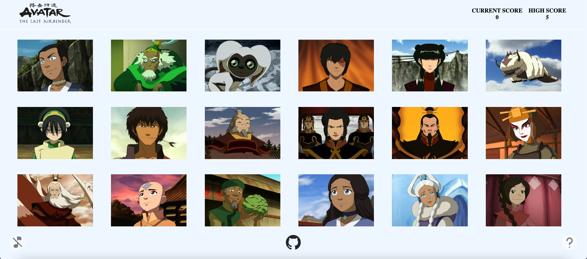

# Memory Card

A card game that tests your memory. Make sure you don't click any card twice!

## Demo

<p align="center">
  
</p>

<h2 align="center">
  <a href="https://memory-card-atla.netlify.app/">👉 Demo</a>
</h2>

## Description

This project was made to allow myself to get used to using React hooks, mainly useEffect() to fetch data from an api
and render the information to my site! After building this project I can confidently say my React skills have improved.

## Features

Classic memory game with Avatar: The Last Airbender Theme.

- Uses [Last Airbender API](https://last-airbender-api.fly.dev/) to render the characters
- Simple and user friendly UI
- Realtime score and best score count
- Can play background music while playing!

## Tech Stack

- **UI Library:** React
- **Languages:** Javascript, CSS, HTML
- **Build Tool:** Vite
- **Dependencies:** react-icons, use-sound

## Run Locally

Clone the project

```bash
  git clone https://github.com/wafas-repo/memory-card.git
```

Go to the project directory 

```bash
  cd memory-card
```

Install dependencies

```bash
  npm install
```

Start the server

```bash
  npm run dev
```
## Acknowledgements

- [Last Airbender API](https://last-airbender-api.fly.dev/)